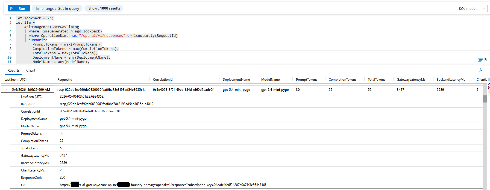
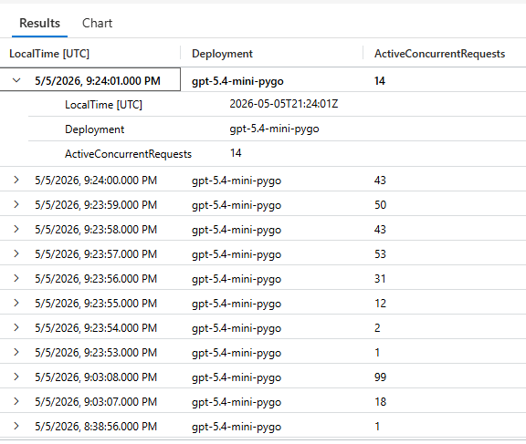
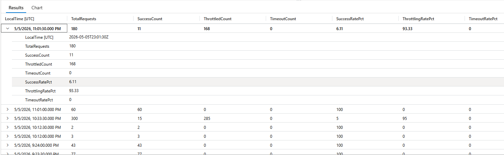

# Azure OpenAI Observability with AI Gateway

A complete observability reference for Azure OpenAI workloads routed through **Microsoft Foundry** and **Azure API Management AI Gateway**, with telemetry flowing into **Azure Monitor Log Analytics** and **Application Insights**.

---

## Architecture Overview

```
┌─────────────────────────────────────────────────────────────────────────────────┐
│                              CLIENT APPLICATION                                  │
│                     (Python SDK / REST / Streaming SSE)                          │
└─────────────────────────────┬───────────────────────────────────────────────────┘
                              │  HTTPS + Subscription Key
                              │  Header: x-apim-test-scenario
                              ▼
┌─────────────────────────────────────────────────────────────────────────────────┐
│                    AZURE API MANAGEMENT (AI GATEWAY)                             │
│                    <your-apim-name>.azure-api.net                                │
│                                                                                  │
│  ┌──────────────────────────────────────────────────────────────────────────┐   │
│  │  INBOUND POLICIES                                                         │   │
│  │  ┌──────────────┐  ┌───────────────────┐  ┌────────────────────────┐    │   │
│  │  │  rate-limit  │  │  llm-token-limit  │  │  set-backend-service   │    │   │
│  │  │  (429/TPM)   │  │  (token quota)    │  │  (route to Foundry)    │    │   │
│  │  └──────────────┘  └───────────────────┘  └────────────────────────┘    │   │
│  └──────────────────────────────────────────────────────────────────────────┘   │
│                                                                                  │
│  ┌──────────────────────────────────────────────────────────────────────────┐   │
│  │  BACKEND POLICIES                                                         │   │
│  │  ┌────────────────────────────────────────────────────────────────────┐  │   │
│  │  │  forward-request (timeout control per scenario)                     │  │   │
│  │  └────────────────────────────────────────────────────────────────────┘  │   │
│  └──────────────────────────────────────────────────────────────────────────┘   │
└──────────┬───────────────────────────────────────────────────┬──────────────────┘
           │                                                   │
           │  Diagnostic Logs                                  │  Forward Request
           ▼                                                   ▼
┌──────────────────────────┐                    ┌─────────────────────────────────┐
│   AZURE MONITOR          │                    │   MICROSOFT FOUNDRY             │
│   Log Analytics          │                    │   <your-foundry-project>        │
│   <your-log-analytics>   │                    │                                 │
│                          │                    │  ┌───────────────────────────┐  │
│  ┌────────────────────┐  │                    │  │  AI Project: proj-default  │  │
│  │ ApiManagementGate- │  │                    │  │                           │  │
│  │ wayLogs            │  │                    │  │  Deployment:              │  │
│  │                    │  │                    │  │  gpt-5.4-mini-pygo        │  │
│  │ ApiManagementGate- │  │                    │  └───────────────────────────┘  │
│  │ wayLlmLog          │  │                    └─────────────────────────────────┘
│  │                    │  │
│  │ AzureMetrics       │  │
│  └────────────────────┘  │
└──────────────────────────┘
           │
           │  (same workspace)
           ▼
┌──────────────────────────┐
│  APPLICATION INSIGHTS    │
│  <your-app-insights>     │
│  insights                │
│                          │
│  ┌────────────────────┐  │
│  │  customEvents      │  │
│  │  customMetrics     │  │
│  │  (TTFT / TTLT)     │  │
│  │                    │  │
│  │  requests          │  │
│  │  traces            │  │
│  └────────────────────┘  │
└──────────────────────────┘
```

---

## What Was Built

### 1. Microsoft Foundry AI Project
- Created an AI project (`proj-default`) in **Microsoft Foundry** with deployment `gpt-5.4-mini-pygo`
- The project endpoint (`https://<your-foundry-project>.services.ai.azure.com`) serves as the backend for the AI Gateway

### 2. Azure API Management — AI Gateway
- Enabled **Foundry AI Gateway** on the APIM instance (`<your-apim-name>`)
- Imported the Foundry API under path `/<your-foundry-project>`
- The Responses API route: `POST /openai/v1/responses`
- Configured inbound policies:
  - `rate-limit` — limits request throughput per subscription (for throttling control)
  - `llm-token-limit` — enforces token-per-minute and quota budgets per deployment
  - `set-backend-service` — routes to the Foundry backend
- Configured backend policies:
  - `forward-request` with per-scenario timeout control

### 3. Azure Monitor — Log Analytics Workspace
- Created workspace `<your-log-analytics-workspace>` (East US 2)
- Enabled APIM Diagnostic Settings with **Resource Specific** destination table
- Explicitly selected categories:
  - `Logs related to ApiManagement Gateway` → `ApiManagementGatewayLogs`
  - `Logs related to generative AI gateway` → `ApiManagementGatewayLlmLog`
- Enabled API-level LLM logging: **Log LLM messages**, Log prompts, Log completions

### 4. Application Insights
- Connected `<your-application-insights>` to the APIM instance
- Captures request telemetry, trace, exceptions, and custom metrics from client-side instrumentation (TTFT/TTLT for streaming)

---

## Telemetry Reference

### Azure Monitor Log Analytics Tables

| Table | Source | Key Fields |
|-------|--------|------------|
| `ApiManagementGatewayLogs` | APIM Gateway — all requests | `CorrelationId`, `ResponseCode`, `TotalTime`, `BackendTime`, `ClientTime`, `Url`, `Method`, `LastErrorReason` |
| `ApiManagementGatewayLlmLog` | APIM AI Gateway — LLM calls only | `RequestId`, `CorrelationId`, `PromptTokens`, `CompletionTokens`, `TotalTokens`, `DeploymentName`, `ModelName`, `IsStreamCompletion` |
| `AzureMetrics` | APIM platform metrics | `MetricName`, `Total`, `Average`, `Maximum` |

> **Note:** `ApiManagementGatewayLlmLog` only populates for requests that reach the LLM backend. Throttled (429) requests never generate LLM log entries because they are blocked before forwarding.

### Application Insights Tables

| Table | Content |
|-------|---------|
| `customEvents` | Client-emitted events (e.g., `streaming_request_completed`) |
| `customMetrics` | Client-emitted measurements (e.g., `ttft_ms`, `ttlt_ms`) |
| `requests` | APIM-correlated request telemetry |
| `traces` | APIM trace policy output |

### Azure Monitor vs Application Insights — When to Use Each

| Need | Use |
|------|-----|
| Token counts per request | Azure Monitor (`ApiManagementGatewayLlmLog`) |
| Gateway/backend latency | Azure Monitor (`ApiManagementGatewayLogs`) |
| Throttling and error rates | Azure Monitor (`ApiManagementGatewayLogs`) |
| Active concurrency | Azure Monitor (join `GatewayLogs` + `LlmLog`) |
| TTFT / TTLT (streaming) | Application Insights (`customMetrics`) |
| End-to-end tracing | Application Insights (`requests` + `traces`) |
| Platform capacity metrics | Azure Monitor (`AzureMetrics`) |

---

## KQL Queries

All queries target your Log Analytics workspace (`<your-log-analytics-workspace>`).

> **Disclaimer:** The queries below are **sample / reference implementations only**. They are intended to illustrate how specific observability metrics can be computed using Azure Monitor KQL and are **not production-ready**. Before using these in a production environment, review them against your actual table schemas, data volumes, retention policies, and performance requirements. Some patterns (e.g., per-second `mv-expand` over large time ranges) can be costly at scale and should be optimized accordingly.

---

### 1. Per-Request Token Counts with Latency
**What it does:** Returns one row per unique LLM request, showing token consumption (prompt, completion, total) alongside gateway, backend, and client latency. Use this to answer: *"How many tokens did each request consume, and how long did it take?"*

```kusto
let lookback = 2h;
let llm =
    ApiManagementGatewayLlmLog
    | where TimeGenerated > ago(lookback)
    | where OperationName has "/openai/v1/responses" or isnotempty(RequestId)
    | summarize
        PromptTokens = max(PromptTokens),
        CompletionTokens = max(CompletionTokens),
        TotalTokens = max(TotalTokens),
        DeploymentName = any(DeploymentName),
        ModelName = any(ModelName),
        CorrelationId = any(CorrelationId),
        LastSeen = max(TimeGenerated)
      by RequestId;
let gw =
    ApiManagementGatewayLogs
    | where TimeGenerated > ago(lookback)
    | where Url has "/openai/v1/responses"
    | where isnotempty(CorrelationId)
    | summarize
        GatewayLatencyMs = max(TotalTime),
        BackendLatencyMs = max(BackendTime),
        ClientLatencyMs = max(ClientTime),
        ResponseCode = any(ResponseCode),
        Url = any(Url)
      by CorrelationId;
llm
| join kind=leftouter gw on CorrelationId
| order by LastSeen desc
| project
    LastSeen,
    RequestId,
    CorrelationId,
    DeploymentName,
    ModelName,
    PromptTokens,
    CompletionTokens,
    TotalTokens,
    GatewayLatencyMs,
    BackendLatencyMs,
    ClientLatencyMs,
    ResponseCode,
    Url
```



---

### 2. Active Concurrent Requests per Deployment (Per Second, Local Time)
**What it does:** Reconstructs each request's active time window using gateway start and end times, then counts how many requests were in-flight simultaneously at each second. Use this to answer: *"What was my peak concurrency and when did it occur?"*

```kusto
let lookback = 2h;
let local_tz = "America/New_York";
let gw =
    ApiManagementGatewayLogs
    | where TimeGenerated > ago(lookback)
    | where Url has "/openai/v1/responses"
    | where isnotempty(CorrelationId)
    | extend EndTime = TimeGenerated
    | extend StartTime = EndTime - totimespan(TotalTime * 1ms)
    | project CorrelationId, StartTime, EndTime;
let llm =
    ApiManagementGatewayLlmLog
    | where TimeGenerated > ago(lookback)
    | where isnotempty(CorrelationId)
    | summarize DeploymentName = any(DeploymentName) by CorrelationId;
gw
| join kind=leftouter llm on CorrelationId
| extend Deployment = coalesce(DeploymentName, "unknown")
| extend s = bin(StartTime, 1s), e = bin(EndTime, 1s)
| mv-expand ts_utc = range(s, e, 1s) to typeof(datetime)
| summarize ActiveConcurrentRequests = count() by Deployment, ts_utc
| extend LocalTime = coalesce(datetime_utc_to_local(ts_utc, local_tz), ts_utc)
| project LocalTime, Deployment, ActiveConcurrentRequests
| order by LocalTime desc, Deployment asc
```



---

### 3. Max Concurrency and Headroom per Deployment
**What it does:** Computes the peak and P95 concurrency observed per deployment over a time window, then compares against a configured limit to show remaining headroom. Use this to answer: *"How close am I to my concurrency limit?"*

```kusto
let lookback = 2h;
let configured_limit = 60; // Set to your actual deployment capacity
let gw =
    ApiManagementGatewayLogs
    | where TimeGenerated > ago(lookback)
    | where Url has "/openai/v1/responses"
    | where isnotempty(CorrelationId)
    | extend EndTime = TimeGenerated
    | extend StartTime = EndTime - totimespan(TotalTime * 1ms)
    | project CorrelationId, StartTime, EndTime;
let llm =
    ApiManagementGatewayLlmLog
    | where TimeGenerated > ago(lookback)
    | where isnotempty(CorrelationId)
    | summarize DeploymentName = any(DeploymentName) by CorrelationId;
let active =
    gw
    | join kind=leftouter llm on CorrelationId
    | extend Deployment = coalesce(DeploymentName, "unknown")
    | extend s = bin(StartTime, 1s), e = bin(EndTime, 1s)
    | mv-expand ts = range(s, e, 1s) to typeof(datetime)
    | summarize ActiveConcurrentRequests = count() by Deployment, ts;
active
| summarize MaxConcurrency = max(ActiveConcurrentRequests), P95Concurrency = percentile(ActiveConcurrentRequests, 95) by Deployment
| extend ConfiguredLimit = configured_limit
| extend Headroom = ConfiguredLimit - MaxConcurrency
| extend HeadroomPct = round(100.0 * Headroom / ConfiguredLimit, 2)
| order by MaxConcurrency desc
```

---

### 4. Error, Timeout, and Throttling Rates — 30-Second Intervals (Local Time)
**What it does:** Aggregates all gateway requests into 30-second buckets, classifying each request as success, throttled (429), timeout (408/504 or timeout error reason), or other error. Use this to answer: *"What percentage of requests are being throttled or timing out over time?"*

```kusto
let lookback = 2h;
let grain = 30s;
let local_tz = "America/New_York";
ApiManagementGatewayLogs
| where TimeGenerated > ago(lookback)
| where Url has "/openai/v1/responses"
| extend BucketUtc = bin(TimeGenerated, grain)
| extend IsTimeout = ResponseCode in (408, 504)
    or tostring(LastErrorReason) has_cs "timeout"
    or tostring(LastErrorMessage) has_cs "timeout"
| summarize
    TotalRequests = count(),
    SuccessCount = countif(ResponseCode between (200 .. 299)),
    ThrottledCount = countif(ResponseCode == 429),
    TimeoutCount = countif(IsTimeout)
  by BucketUtc
| extend
    SuccessRatePct = round(100.0 * SuccessCount / TotalRequests, 2),
    ThrottlingRatePct = round(100.0 * ThrottledCount / TotalRequests, 2),
    TimeoutRatePct = round(100.0 * TimeoutCount / TotalRequests, 2)
| extend LocalTime = coalesce(datetime_utc_to_local(BucketUtc, local_tz), BucketUtc)
| project LocalTime, TotalRequests, SuccessCount, ThrottledCount, TimeoutCount, SuccessRatePct, ThrottlingRatePct, TimeoutRatePct
| order by LocalTime desc
```



---

### 5. Throttling and Error Rates by Endpoint and Deployment
**What it does:** Extends the rate query by breaking it down per endpoint path and deployment name. Useful for multi-deployment or multi-API environments. Use this to answer: *"Which endpoint and deployment has the highest throttling rate?"*

```kusto
let lookback = 2h;
let grain = 30s;
let local_tz = "America/New_York";
let llm =
    ApiManagementGatewayLlmLog
    | where TimeGenerated > ago(lookback)
    | where isnotempty(CorrelationId)
    | summarize DeploymentName = any(DeploymentName), ModelName = any(ModelName) by CorrelationId;
ApiManagementGatewayLogs
| where TimeGenerated > ago(lookback)
| where Url has "/openai/v1/responses"
| join kind=leftouter llm on CorrelationId
| extend Deployment = coalesce(DeploymentName, "unknown")
| extend Endpoint = tostring(parse_url(Url).Path)
| extend BucketUtc = bin(TimeGenerated, grain)
| summarize
    TotalRequests = count(),
    Success2xx = countif(ResponseCode between (200 .. 299)),
    Throttled429 = countif(ResponseCode == 429),
    OtherErrors = countif(ResponseCode >= 400 and ResponseCode != 429)
  by BucketUtc, Endpoint, Deployment
| extend
    ThrottlingRatePct = round(100.0 * Throttled429 / TotalRequests, 2),
    SuccessRatePct = round(100.0 * Success2xx / TotalRequests, 2),
    ErrorRatePct = round(100.0 * OtherErrors / TotalRequests, 2)
| extend LocalTime = coalesce(datetime_utc_to_local(BucketUtc, local_tz), BucketUtc)
| project LocalTime, Endpoint, Deployment, TotalRequests, Success2xx, Throttled429, OtherErrors, ThrottlingRatePct, SuccessRatePct, ErrorRatePct
| order by LocalTime desc, Endpoint asc, Deployment asc
```

---

### 6. Token Consumption Summary (Last 24 Hours)
**What it does:** Aggregates token usage across all requests into a single summary row — total requests processed, total tokens consumed, and average tokens per request. Use this for billing estimation and capacity planning.

```kusto
ApiManagementGatewayLlmLog
| where TimeGenerated > ago(24h)
| summarize
    PromptTokens = max(PromptTokens),
    CompletionTokens = max(CompletionTokens),
    TotalTokens = max(TotalTokens)
  by RequestId
| summarize
    Requests = count(),
    SumPromptTokens = sum(PromptTokens),
    SumCompletionTokens = sum(CompletionTokens),
    SumTotalTokens = sum(TotalTokens),
    AvgPromptTokens = round(avg(PromptTokens), 2),
    AvgCompletionTokens = round(avg(CompletionTokens), 2),
    AvgTotalTokens = round(avg(TotalTokens), 2)
```

---

### 7. Streaming TTFT / TTLT from Application Insights
**What it does:** Queries client-emitted custom metrics for streaming requests to surface Time To First Token (TTFT) and Time To Last Token (TTLT). These are measured at the client side during SSE stream consumption and pushed to Application Insights. Use this to answer: *"How responsive is the model for streaming users?"*

```kusto
// Query custom events emitted from Python client
customEvents
| where name == "streaming_request_completed"
| where tostring(customDimensions.run_id) has "stream-sse"
| project
    TimeGenerated,
    RequestIndex = tostring(customDimensions.request_index),
    ClientRequestId = tostring(customDimensions.client_request_id),
    StatusCode = tostring(customDimensions.status_code),
    TTFT_ms = todouble(customMeasurements["ttft_ms"]),
    TTLT_ms = todouble(customMeasurements["ttlt_ms"]),
    Latency_s = todouble(customMeasurements["latency_s"])
| order by TimeGenerated desc
```

---

## Key Concepts

### Why `max()` Instead of `sum()` for Token Deduplication
`ApiManagementGatewayLlmLog` can produce multiple rows per request (for example in streaming scenarios with sequence numbers). Using `max()` aggregated `by RequestId` ensures each request is counted once and prevents overcounting.

### Why Throttled Requests Show `unknown` Deployment
Throttled requests (429) are blocked by APIM's `rate-limit` policy **before** the request reaches the LLM backend. Since no backend call is made, no `ApiManagementGatewayLlmLog` row is created for those requests, so the deployment join returns null and falls back to `"unknown"`.

### TTFT / TTLT Measurement
The Responses API returns streaming responses in **SSE (Server-Sent Events)** format with `event:` and `data:` prefixed lines. True TTFT and TTLT can only be measured at the **HTTP client level** by timing chunk arrivals. APIM policy timing (`ClientTime`, `TotalTime`) provides an approximation:
- `ClientTime` ≈ TTFT (time until response headers reached client)
- `TotalTime` ≈ TTLT (total gateway-to-client time)

---

## Environment Configuration

```env
TENANT_ID=<your-tenant-id>
AZURE_OPENAI_SCOPE=https://ai.azure.com/.default
SUB_ID=<your-subscription-id>
PYGO_DEPLOYMENT=gpt-5.4-mini-pygo
PROJECT_ENDPOINT=https://<your-foundry-project>.services.ai.azure.com/api/projects/proj-default
```

---

## Security Note

The APIM subscription key used during testing should be **rotated** after any test session where it was exposed in code, screenshots, or chat sessions. Rotate via: **APIM portal → Subscriptions → Regenerate key**.
